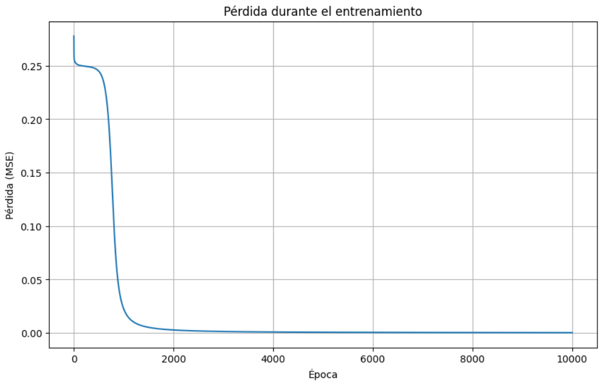

[English Version](README.md)

# Proyecto 1 - Red Neuronal desde Cero (NumPy)

## Objetivo

Implementar una red neuronal completamente desde cero utilizando únicamente NumPy.

El objetivo principal de este proyecto no fue obtener el mejor rendimiento posible, sino comprender en profundidad cómo funciona una red neuronal internamente sin utilizar librerías de Deep Learning como PyTorch o TensorFlow.

Toda la lógica del entrenamiento fue implementada manualmente.

---

# Problema

La red aprende la función lógica XOR.

| Entrada 1 | Entrada 2 | Salida |
|-----------:|-----------:|-------:|
| 0 | 0 | 0 |
| 0 | 1 | 1 |
| 1 | 0 | 1 |
| 1 | 1 | 0 |

Este problema es especialmente interesante porque **no puede resolverse mediante una única neurona**, por lo que obliga a utilizar al menos una capa oculta.

---

# Arquitectura

La red utilizada fue:

```
2 entradas
     │
     ▼
3 neuronas ocultas (Sigmoid)
     │
     ▼
1 neurona de salida (Sigmoid)
```

---

# Conceptos implementados

Todo fue implementado manualmente:

- Forward propagation
- Función Sigmoid
- Derivada de la Sigmoid
- Error Cuadrático Medio (MSE)
- Backpropagation
- Descenso por Gradiente
- Actualización de pesos y sesgos
- Inicialización aleatoria de parámetros

No se utilizó ningún framework de Machine Learning.

---

# Flujo del entrenamiento

Cada época realiza los siguientes pasos:

1. Forward propagation
2. Cálculo de la pérdida (Loss)
3. Backpropagation
4. Cálculo de gradientes
5. Actualización de pesos y bias

```
Entradas
    │
    ▼
Forward
    │
    ▼
Predicción
    │
    ▼
Loss
    │
    ▼
Backpropagation
    │
    ▼
Gradientes
    │
    ▼
Actualización de parámetros
```

---

# Resultados

Después del entrenamiento la red aprende correctamente la función XOR.

Ejemplo de salida:

```
[[0.0077]
 [0.9839]
 [0.9839]
 [0.0207]]
```

Lo esperado era:

```
[[0]
 [1]
 [1]
 [0]]
```

La red logra aproximar correctamente la solución.

---

# Curva de entrenamiento

Durante el entrenamiento la pérdida disminuye de forma progresiva hasta converger.



---

# Aprendizajes

Este proyecto permitió comprender:

- Qué representa una neurona.
- Qué son los pesos y los bias.
- Cómo se realiza el Forward Pass.
- Cómo se calcula la función de pérdida.
- Cómo funciona el algoritmo Backpropagation.
- Cómo el Descenso por Gradiente modifica los parámetros para minimizar el error.
- La influencia del Learning Rate.
- La importancia de la inicialización de los pesos.

---

# Tecnologías

- Python
- NumPy
- Matplotlib

---

##### Ramiro Alvarez