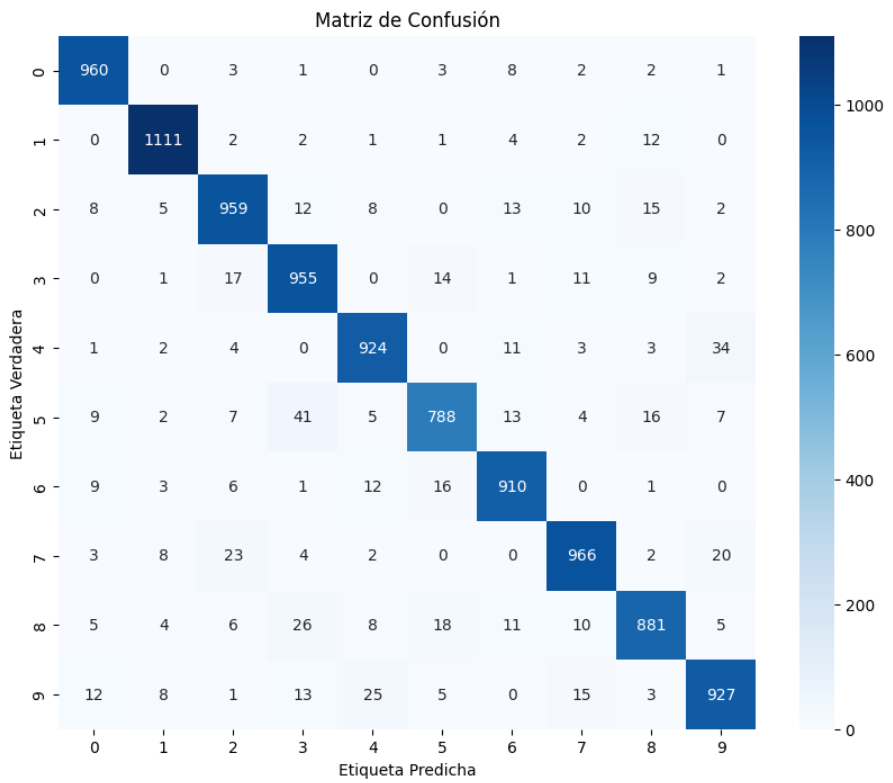

[English Version](README.md)

# Proyecto 2 - Clasificación de Dígitos Manuscritos con PyTorch (MNIST)

## Objetivo

Construir y entrenar un Perceptrón Multicapa (MLP) usando PyTorch para clasificar dígitos manuscritos del conjunto de datos MNIST.

A diferencia del proyecto anterior, donde cada componente de la red neuronal fue implementado manualmente con NumPy, este proyecto se centra en comprender cómo PyTorch automatiza el proceso de entrenamiento mediante diferenciación automática (Autograd).

---

# Dataset

El modelo se entrena utilizando el conjunto de datos **MNIST**.

- 60,000 imágenes de entrenamiento
- 10,000 imágenes de prueba
- Imágenes en escala de grises
- Resolución: **28 × 28 píxeles**
- 10 clases (dígitos del 0 al 9)

Cada imagen se transforma en un tensor con forma:

```
1 × 28 × 28
```

Antes de entrar a la red neuronal, la imagen se aplana en un vector de:

```
784 características
```

---

# Arquitectura del Modelo

El modelo implementado es una red neuronal completamente conectada.

```
Entrada (28×28)
↓
Flatten
↓
Linear (784 → 128)
↓
ReLU
↓
Linear (128 → 64)
↓
ReLU
↓
Linear (64 → 10)
↓
Logits
```

A diferencia del primer proyecto, la capa final no usa una función Sigmoid.

En su lugar, devuelve valores crudos llamados **logits**, que son procesados internamente por la función de pérdida CrossEntropy.

---

# Flujo de Entrenamiento

El ciclo de entrenamiento sigue estos pasos para cada mini-batch:

1. Forward pass
2. Cálculo de la pérdida CrossEntropy
3. Limpieza de gradientes anteriores
4. Backpropagation (`loss.backward()`)
5. Actualización de los parámetros del modelo (`optimizer.step()`)

PyTorch calcula automáticamente cada gradiente usando Autograd.

---

# Función de Pérdida

El modelo utiliza:

```python
nn.CrossEntropyLoss()
```

Esta pérdida combina:

- Softmax
- Negative Log Likelihood

en una sola operación numéricamente estable.

---

# Optimizador

El entrenamiento se realiza usando Descenso de Gradiente Estocástico (SGD).

```python
optim.SGD(model.parameters(), lr=0.01)
```

El optimizador actualiza cada parámetro entrenable después de cada mini-batch.

---

# Rendimiento

Después de entrenar durante 10 épocas:

- Precisión de entrenamiento ≈ **93%**
- Precisión de prueba ≈ **94%**

El modelo generaliza bien y no muestra señales significativas de overfitting.

---

# Evaluación

El rendimiento del modelo fue evaluado usando:

- Precisión en test
- Predicciones individuales
- Probabilidades Softmax
- Matriz de confusión

La matriz de confusión muestra que la mayoría de los errores ocurren entre dígitos visualmente similares



Esto indica que el modelo aprendió patrones visuales significativos en lugar de memorizar el dataset.

---

# Conceptos Aprendidos

Este proyecto introdujo varios conceptos fundamentales de Deep Learning:

- Tensores de PyTorch
- Dataset
- DataLoader
- Mini-batches
- Modelos secuenciales
- Capas completamente conectadas
- Activación ReLU
- Logits
- CrossEntropy Loss
- Optimizador SGD
- Diferenciación automática (Autograd)
- Backpropagation
- Modo de entrenamiento vs modo de evaluación
- Accuracy
- Matriz de confusión

---

# Tecnologías

- Python
- PyTorch
- TorchVision
- NumPy
- Matplotlib
- Scikit-learn

---

##### Ramiro Alvarez
