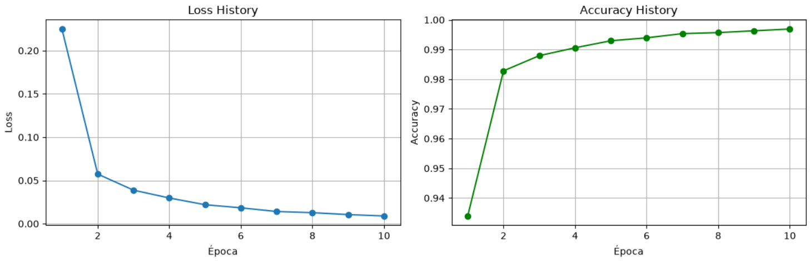
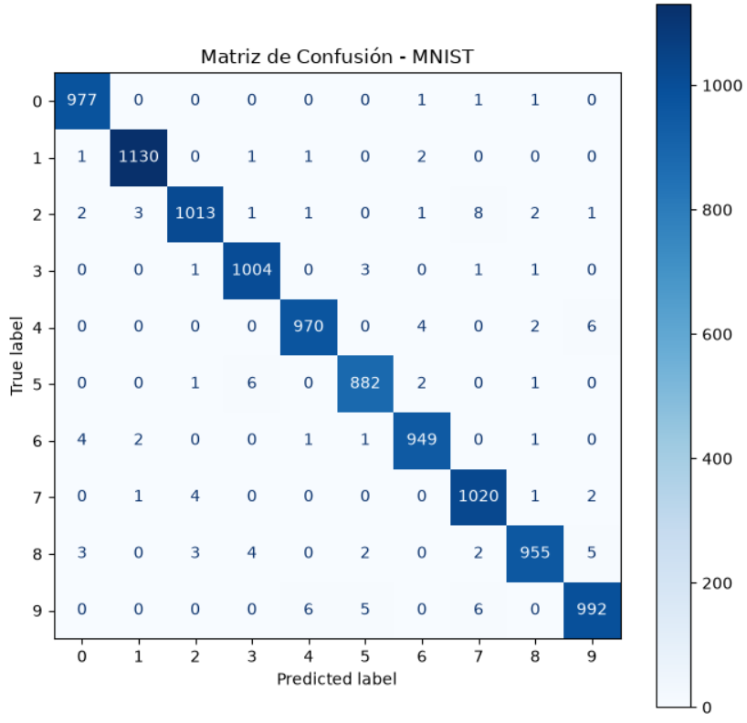
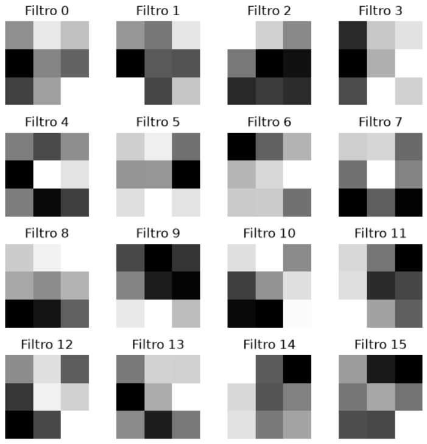
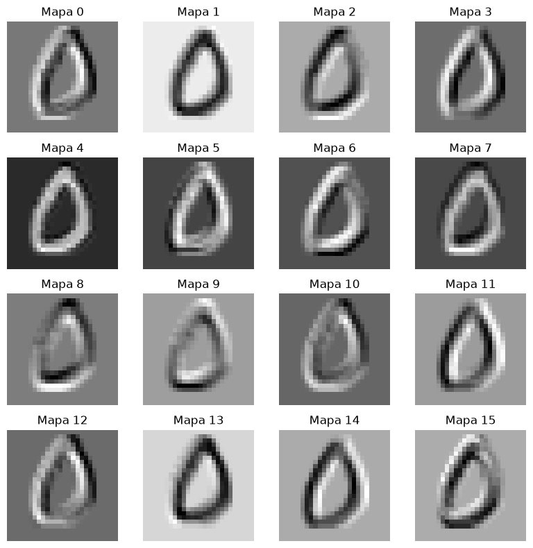

[Versión en Español](README_ES.md)

# Project 3 - Handwritten Digit Classification with a CNN (MNIST)

## Objective

Build and train a Convolutional Neural Network (CNN) with PyTorch to classify handwritten digits from the MNIST dataset.

Compared with the second project, which used a Multilayer Perceptron and learned directly from flattened pixels, this project keeps the spatial structure of the image and uses convolutional layers to learn local visual patterns such as edges, strokes, and curves.

The goal was not only to obtain a strong classifier, but also to understand why CNNs are a better fit than a fully connected network for image data.

---

# Dataset

The model is trained and evaluated on the **MNIST** dataset.

- 60,000 training images
- 10,000 testing images
- Grayscale images
- Resolution: **28 × 28 pixels**
- 10 classes (digits 0–9)

Each image is transformed into a tensor with shape:

```
1 × 28 × 28
```

Unlike the MLP from project 2, the image is **not flattened at the input**. The CNN keeps the spatial layout so the convolutional layers can work on local neighborhoods of pixels.

---

# Model Architecture

The implemented network is a small CNN built with `nn.Sequential`.

```
Input (1×28×28)
↓
Conv2d (1 → 16, kernel=3)
↓
ReLU
↓
MaxPool2d (2)
↓
Conv2d (16 → 32, kernel=3)
↓
ReLU
↓
MaxPool2d (2)
↓
Flatten
↓
Linear (800 → 128)
↓
ReLU
↓
Linear (128 → 10)
↓
Logits
```

The main difference from project 2 is that the first layers do feature extraction automatically.

- `Conv2d` learns filters that detect local visual patterns.
- `MaxPool2d` reduces the spatial size and keeps the strongest responses.
- `Flatten` converts the feature maps into a vector only after the convolutional part has already extracted useful information.

This makes the model more efficient for images than a pure MLP.

---

# Why CNNs Instead of an MLP?

The MLP from project 2 works on flattened pixels, so it treats the image like a long vector and ignores the 2D structure of the digits.

In contrast, this CNN:

- Preserves spatial locality in the early layers.
- Learns reusable filters instead of independent weights for every pixel connection.
- Uses fewer parameters than an equally expressive fully connected network.
- Tends to generalize better on image tasks.

That difference is the core lesson of the project.

---

# Training Pipeline

The training loop follows the same general PyTorch workflow as project 2, but now it is applied to a convolutional model.

1. Put the model in training mode with `model.train()`.
2. Load a batch of images and labels from the `DataLoader`.
3. Clear the previous gradients with `optimizer.zero_grad()`.
4. Run the forward pass through the CNN.
5. Compute the loss with `CrossEntropyLoss`.
6. Run `loss.backward()` to compute gradients.
7. Update the parameters with `optimizer.step()`.
8. Track loss and accuracy for each epoch.

The key difference from project 2 is that the parameters being optimized are not only dense-layer weights, but also convolution kernels that learn image features directly.

---

# Loss Function

The model uses:

```python
nn.CrossEntropyLoss()
```

As in project 2, this loss is the right choice for multi-class classification with raw logits.

It combines:

- Softmax
- Negative Log Likelihood

into a single numerically stable operation.

---

# Optimizer

The training process uses Adam:

```python
optim.Adam(model.parameters(), lr=0.001)
```

Compared with the SGD optimizer used in project 2, Adam adapts the learning rate for each parameter and usually converges faster and more smoothly on this kind of CNN.

---

# Performance

After training for 10 epochs, the model reaches very strong accuracy on MNIST.

The learning curves show a fast drop in loss and a stable increase in accuracy:



The final performance is consistent with a well-trained CNN on MNIST, and the confusion matrix shows that most mistakes happen only between visually similar digits.



---

# What the CNN Learned

One of the most useful parts of this project was visualizing what the model learned internally.

The first convolutional layer learns edge-like and stroke-like filters:



When those filters are applied to a sample image, the activation maps highlight different parts of the digit:



This makes it easier to understand how the network moves from raw pixels to higher-level shape recognition.

---

# Evaluation

The evaluation stage follows the same idea as project 2, but here it is especially useful to inspect the confidence of the CNN and how its output changes with different digits.

The notebook evaluates the model on the full test loader and on individual images.

- Full test accuracy
- Single-image prediction
- Raw logits
- Softmax probabilities
- Confusion matrix

This combination helps verify not only that the model is correct, but also that it is learning meaningful representations.

---

# Concepts Learned

This project introduced several important CNN concepts and reinforced the PyTorch workflow from project 2:

- Convolutional layers
- Learnable filters
- Local receptive fields
- Spatial feature extraction
- Max pooling
- Feature maps
- Flattening after convolution
- CNN classifier design
- Logits for multi-class classification
- CrossEntropy loss
- Adam optimizer
- Training vs evaluation mode
- Accuracy tracking
- Confusion matrix analysis
- Filter and activation visualization

---

# Comparison with Project 2

Project 2 and project 3 solve the same MNIST classification problem, but they do it with different inductive biases.

- Project 2 uses an MLP and starts from flattened pixels.
- Project 3 uses a CNN and preserves image structure.
- Project 2 learns global dense relationships directly.
- Project 3 first learns local visual patterns, then combines them into digit-level features.
- Project 2 is simpler to read as a baseline.
- Project 3 is a more natural and powerful approach for image classification.

Seeing both side by side makes the advantage of convolution much clearer.

---

# Technologies

- Python
- PyTorch
- TorchVision
- NumPy
- Matplotlib
- Scikit-learn

---

##### Ramiro Alvarez
